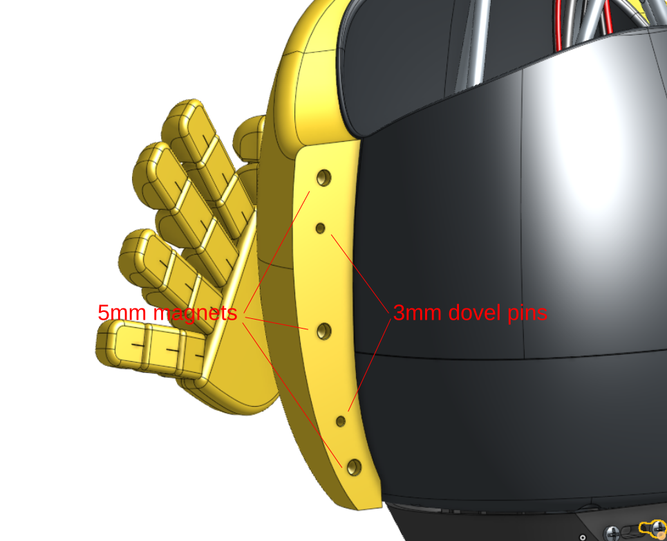
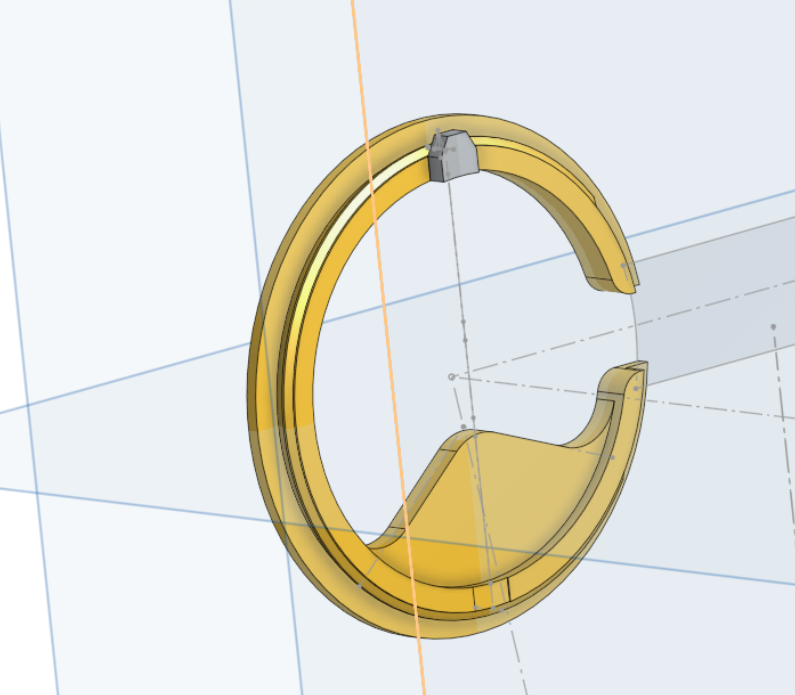
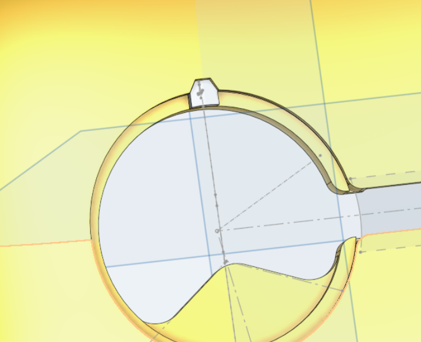
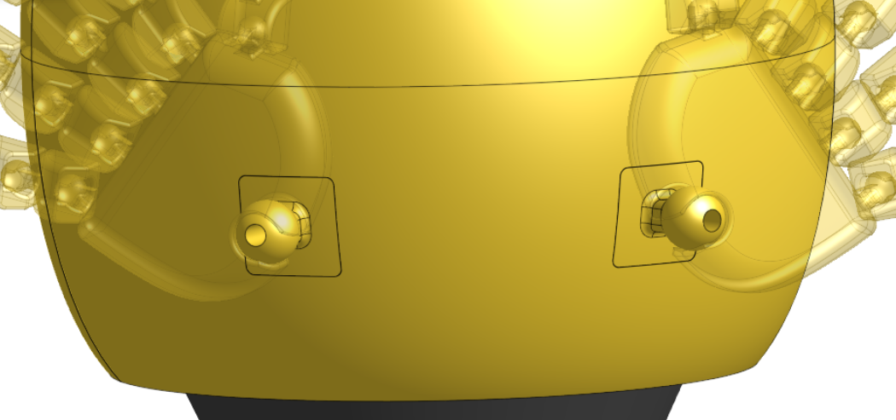
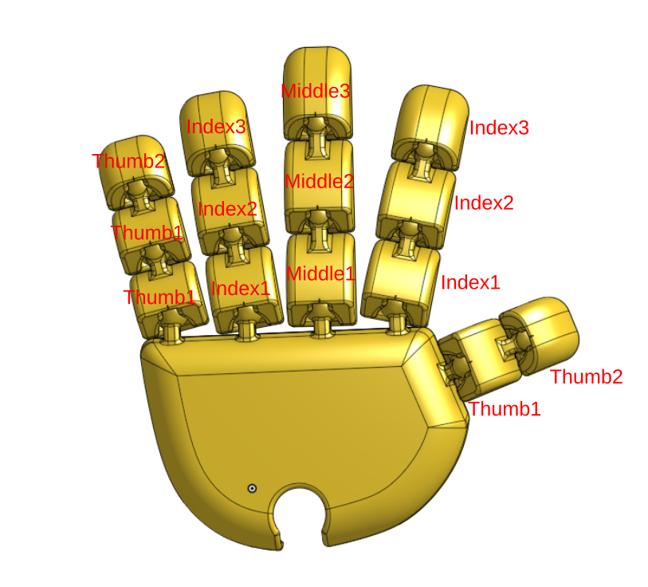

# HuggingFace skin

The shell is held with 3mm pins and 5mm magnets

## Eyes

Eyes can be changed in order to produce different face expressions.
Theyare inserted inside small grooves in the face skin. They are locked in position by glueing small tabs to the eye.

## Hands

Hands are articulated and fixed to the shell using two different blocks inserted in the front shell.

Then for both the left and right hand, phalanges are reused across fingers

