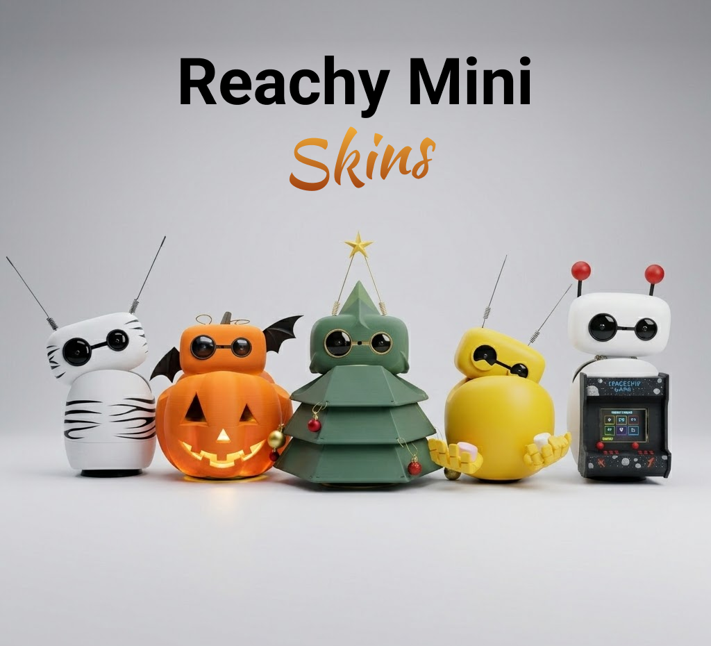

# 🎨 Reachy Mini Skins

A lightweight static gallery to showcase **community and official skins for Reachy Mini**.

This project is a community gallery for **skins, costumes, decorative parts, and shell add-ons** designed for Reachy Mini. The goal is simple: make it easy for anyone to personalize their robot by **adding elements to the existing shell**.

 

Whether you want to create something playful, seasonal, expressive, or polished, this space is here to help the community **share ideas, files, and inspiration**.

## Add a new skin

1. Go to the “Submit your skin” section on the [Reachy Mini Skins Space](https://huggingface.co/spaces/pollen-robotics/reachy-mini-skins)
2. Fill out the form with:
- a name
- a short description (90 max)
- a few tags
- a clean, sharp photo
- a link to the Git repository or any other page containing the instructions and downloadable files
- Click Submit.
This will automatically create a pull request for the Pollen Robotics team to review.
3. Once approved, your skin will appear in the community skin gallery.

## Important note

Some shared files may be community bonus content released for fun and experimentation.

They are not meant to replace the normal product support workflow. If something is wrong with a community STL or experimental skin file, please **do not use the standard support/debug channels for that** unless the issue concerns the robot itself.
