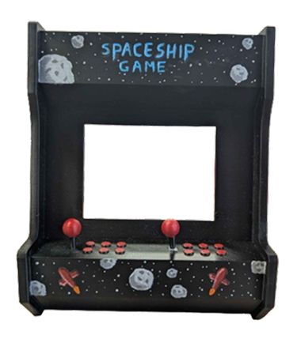
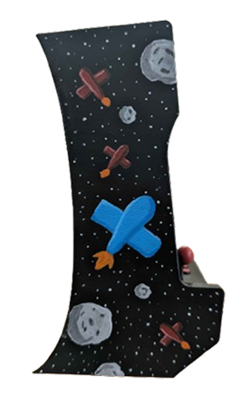
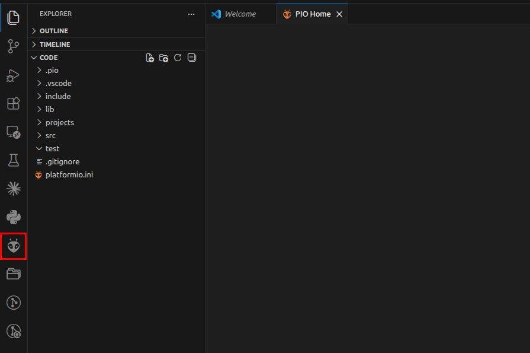
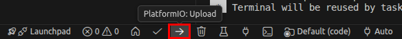
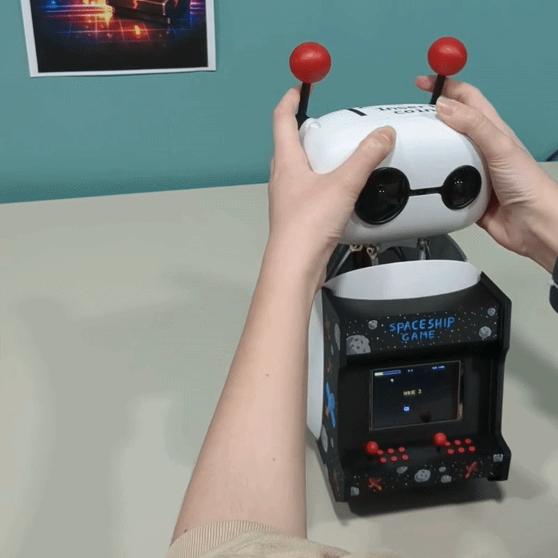

## 🕹️ Arcade Skin


A retro arcade cabinet skin for Reachy Mini, featuring a 3D-printed arcade structure and an added screen.

The screen is connected directly to a PC, bringing the arcade effect to life. The antennas were also 3D printed to match the overall design.

<br clear="left">

---

### Steps to make it :

<details>
<summary><span style="font-size:1.2em"><b>BOM</b></span></summary>

#### 3D Printing
- PLA filament

#### Electronics
- ESP32-2432S028 (Cheap Yellow Display)
- Right-angle USB cable:
  - **Reachy Mini Wireless:** USB-C to USB-C (must be USB-C on both ends)
  - **Reachy Mini Lite:** USB-A to USB-C or USB-C to USB-C

#### Assembly
- Hot glue gun
- 4x M2 5mm screws for the screen

</details>

<details>
<summary><span style="font-size:1.2em"><b>3D Printing</b></span></summary>

STL and STEP files are available in the [`3d-models/`](3d-models/) folder.

| Part | File | Quantity | Supports |
|------|------|----------|----------|
| Arcade body | `reachy_mini_arcade.stl` / `reachy_mini_arcade.step` | 1x | Yes |
| Antenna | `antenna.stl` | 2x | Yes |

**Print settings:** Standard PLA settings. Supports are needed for both parts.

#### Customization

You can paint the parts or add stickers to personalize your arcade skin however you like. For reference, ours is inspired by the [Spaceship Game](https://huggingface.co/spaces/apirrone/spaceship_game), a Reachy Mini app.

<p>


</p>

</details>

<details>
<summary><span style="font-size:1.2em"><b>Electronics</b></span></summary>

The arcade screen uses an **ESP32-2432S028** (aka "Cheap Yellow Display" / CYD). The firmware source code is in the [`code/`](code/) folder — it's a PlatformIO project.

#### Flashing the firmware

1. Connect the ESP32 to your PC via USB
2. Clone this repository:
   ```bash
   git clone https://github.com/pollen-robotics/reachy-mini-skins.git
   ```

3. **Upload the code:**

<details>
<summary><b>From the command line</b></summary>

- Install PlatformIO CLI (a virtual environment is recommended):
   ```bash
   pip install platformio
   ```
- Navigate to the firmware folder and upload:

   **Linux / macOS:**
   ```bash
   cd reachy-mini-skins/arcade/code
   pio run -e arcade --target upload
   ```

   **Windows:**
   ```powershell
   cd reachy-mini-skins\arcade\code
   pio run -e arcade --target upload
   ```

</details>

<details>
<summary><b>From VS Code</b></summary>

- Install [VS Code](https://code.visualstudio.com/) and the [PlatformIO extension](https://marketplace.visualstudio.com/items?itemName=platformio.platformio-ide)
- Open the `reachy-mini-skins/arcade/code` folder in VS Code
- Click the PlatformIO icon in the sidebar:

  

- Click the **Upload** button at the bottom of VS Code:

  

</details>

Once uploaded, the screen should power on and display the arcade menu.

</details>

<details>
<summary><span style="font-size:1.2em"><b>Assembly</b></span></summary>

1. **Prepare the parts**
   - Make sure all printed parts are ready
   - Remove supports and clean up the surfaces
   - Make sure you have flashed the firmware onto the ESP32 (see Electronics section above)

2. **Replace the antennas**
   - Unscrew the stock antenna screws on Reachy Mini
   - Replace them with the 3D-printed antennas and screw them back in

3. **Mount the screen**
   - Screw the screen onto the arcade body (4x M2 5mm screws)
   - Optionally, glue the screen cable in place to prevent it from moving around

4. **Attach the body skin**
   - Place the arcade body shell onto Reachy Mini
   - For now there is no snap or screw attachment — simply use a hot glue gun to secure the shell to the robot

5. **Connect the arcade**
   - **Reachy Mini Wireless:** plug the USB-C cable into the USB-C port on the back of the robot
   - **Reachy Mini Lite:** plug the USB cable into your PC

</details>

---

### Ready to use the arcade?

1. Turn on Reachy Mini
2. Make sure the arcade screen is connected:
   - **Wireless:** to the USB-C port on the back of the robot
   - **Lite:** to your PC
3. Download and launch the [Arcade app](https://huggingface.co/spaces/cdeplanne/arcade) from the Reachy Mini desktop app
4. On the landing page, choose **"With physical arcade"**
5. The app will automatically scan USB ports and detect the ESP32 — once detected, you're ready to play!

> If the arcade is not detected automatically, make sure the ESP32 is plugged in and the firmware is flashed. You can also select the port manually from the setup page.

Now all that's left is to play!


