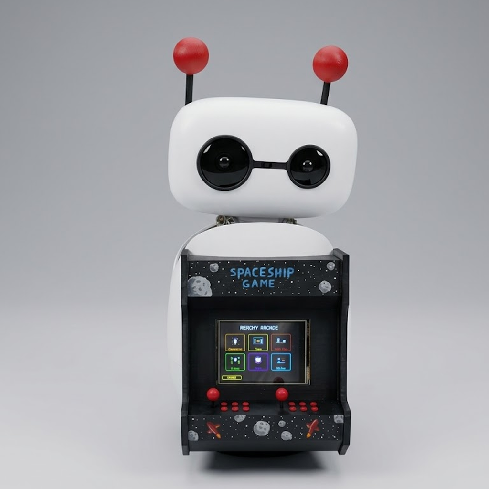

## 🕹️ Arcade skin

A retro arcade cabinet skin for Reachy Mini, featuring a 3D-printed arcade structure painted by hand and completed with an added screen. 

The screen is connected directly to a PC, bringing the arcade effect to life. 

The antennas were also 3D printed and painted to match the overall design.

 

### Steps to make it

1. **3D print the provided files**

   You can print the parts directly in black filament.
   
2. **Paint the parts** or **print stickers**

   For reference, we used:

4. **Assemble everything**
