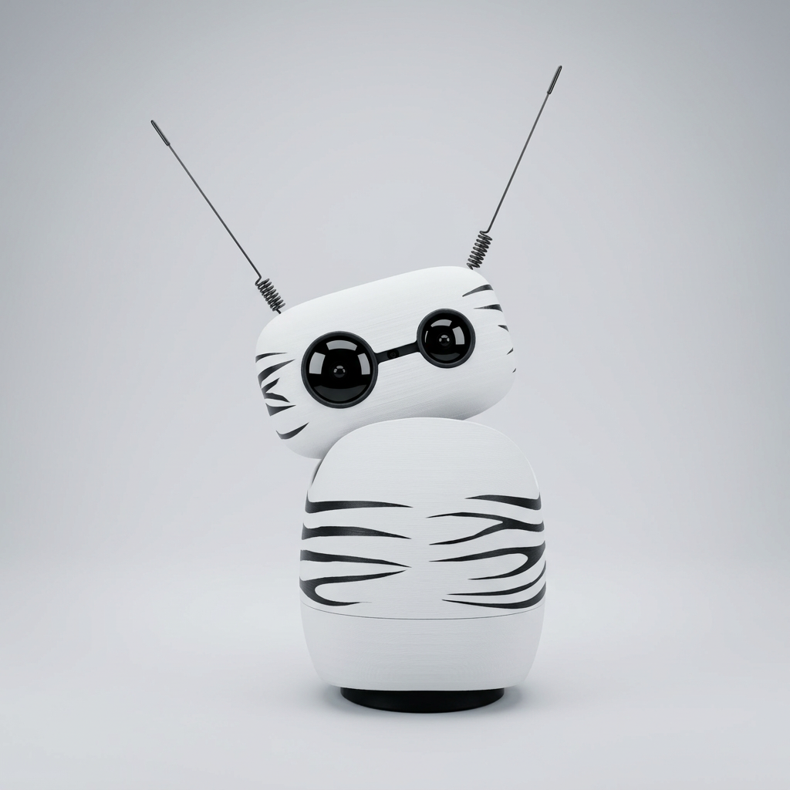

## 🦓 Zebra skin

Bring a playful zebra look to Reachy Mini with a simple sticker-based customization that lets you decorate the shell without damaging the robot.

 

### Steps to make it

1. **Print the pattern on an A4 sticker sheet**
   For reference, we used this [format](https://www.bruneau.fr/product/etiquette-multi-usages-avery-office-star-blanche/ST04975#oabtgroup=Groupe%20B&oabtopencours=AutomaticSpotlight-T1&ocontext=LightProductTemplate%20ProductZone-5&otype=Merchandising%20produits&ovalue=merch-2024-etiquette-adressage-expedition)

2. **Cut the stripes with scissors**
   Trim and shorten the stripes depending on the visual effect you want on the robot’s body or head.

3. **Apply the stickers where you want**
   Place the stripes on the shell in the desired areas to create your own zebra style.
